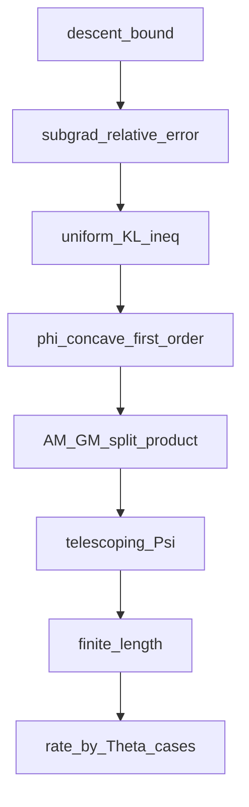
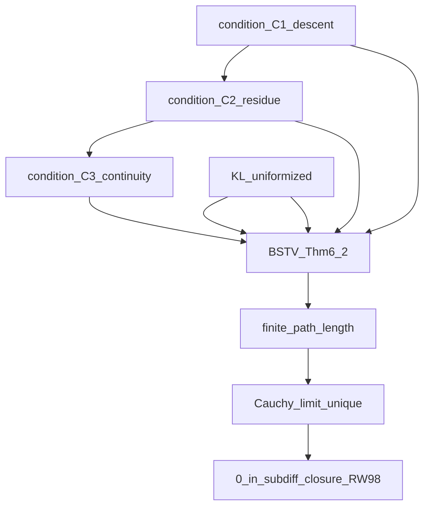

# Kurdyka–Łojasiewicz 框架与算法收敛性

## 1. 目的、范围与符号歧义

**何时使用本 Skill**

- 在**无全局凸/强凸**时，为下降型迭代（梯度/邻近/镜像/ PALM 等）建立**步长可和、有限长**、**Cauchy/收敛**与**临界点**结论；并对照你方论文的 **BSTV18 Appendix 6, Theorem 6.2** 路线
- 写论文时把主文献中的 **(C1)(C2)(C3) 与 KŁ、Uniformized KŁ** 的假设**逐条**对齐到算法

**KŁ 与 KL 散度**（必须区分）

- 论文/代码里常把 Kurdyka–Łojasiewicz 记作「KL 性质」；本 Skill 在中文称 **KŁ**，以区别于 **Kullback–Leibler 散度**（熵、\(D*{KL}\)、\(D*\phi\) 等 Bregman 项）
- **Kullback–Leibler 散度**若必须缩写，写作 \(D*{KL}\) 或负熵对应的 **Bregman 项** \(D*\phi\)（与 KŁ 的去奇异化 \(\varphi\)、\(\psi\in\Phi\_\eta\) 区分），避免单写「KL」不指明对象
- 与仓库正文一致时：允许「KL 性质」= KŁ，但**同段**与 **KL 散度/负熵** 并列时须**区分**措辞，避免二义

**数学写作约定**（与仓库 [AGENTS.md](../../../AGENTS.md) 一致）

- 推理用等式/不等式/存在常数，**不用** `≈`；允许渐近 \(O, o\)

**文献锚点（以本仓论文为准）**：[mainbody.tex](../../../BGW_sustech_ShenBohan/sections/mainbody.tex)（§ 收敛性）、[appendices.tex](../../../BGW_sustech_ShenBohan/sections/appendices.tex)（充分下降、BSTV 验证）；KŁ 定义、\(w^{t+1}\) 的构造、RW98 闭性，均可在该处核对。

---

## 2. 统一记号表

| 符号                                      | 含义                                                                                                                                                               |
| ----------------------------------------- | ------------------------------------------------------------------------------------------------------------------------------------------------------------------ |
| \(f\) / \(G\)                             | 目标，常含指示函数如 \(G=f+\delta_C\)；KŁ 与次微分**总**在 **limiting (Mordukhovich) subdifferential** 框架下书写（与 BSTV 一致）                                  |
| \(\{x^k\}\) 或迭代 \(t\)                  | 生成列；下标依论文（本仓内层为 \(\pi^t\)）                                                                                                                         |
| \(\bar x, x^\ast\)                        | 参考临界点或**极限**                                                                                                                                               |
| \(\operatorname{dist}(0, \partial f(x))\) | 到次微分原点的距离；**光滑**无约束时等于 \(\lVert\nabla f(x)\rVert\)（欧氏下）                                                                                     |
| \(\omega(x^0)\)                           | 极限点集；若已证**全列收敛**则为单点，不必再谈「多聚点」                                                                                                           |
| **去奇异化** 函数                         | 可记作 \(\varphi\)；**若**与 Bregman 生成函数**同名**冲突，**正文可改用** \(\psi\in\Phi\_\eta\)（见 BGW 正文脚注与联合目标处）                                     |
| (C1)                                      | **充分下降**（sufficient decrease）：值降与步长/ Bregman 项联系                                                                                                    |
| (C2)                                      | **次梯度误差/相对残差**控制：\(\lVert w^{k+1}\rVert \le \rho\,\lVert x^{k+1}-x^k\rVert\)，**其中** \(w^{k+1}\in\partial G(x^{k+1})\) 由一阶/镜像最优性**显式构造** |
| (C3)                                      | **半连续性/沿序列连续** 等，使次微分**闭性**可套用                                                                                                                 |

---

## 3. KŁ 在证明中解决什么

- 在极限值附近，把「**次梯度/残量**小到某种程度（由 \(\varphi'\) 标度）与**值差**小」用不等式**拴在一起**，再与 (C1)(C2) 的**可求和/望远镜** 论证配合，得 \(\sum \lVert x^{k+1}-x^k\rVert <\infty\)
- **不**替代 (C2)：(C2) 把 **KŁ 中** 出现的 \(\operatorname{dist}(0,\partial G(\cdot))\) 与**算法步**联系起来；单独「光滑**梯度范数 = 步**」的写法**不**够用于带约束+镜像的 \(G\)

---

## 4. KŁ 定义（与 BGW 正文一致）

**可积形式**（[mainbody.tex 中 Definition](../../../BGW_sustech_ShenBohan/sections/mainbody.tex)）  
\(f:\mathbb R^n \to \mathbb R\cup\{+\infty\}\) 在 \(\bar x\) 满足 **KŁ**，若存在 \(\bar\eta>0\)、邻域 \(U\)、\(\varphi:(0,\bar\eta)\to\mathbb R\_+\) 为 \(C^1\)、\(\varphi'>0\)、\(\varphi(0^+)=0\) 等标准条件，且当 \(x\in U\) 且 \(f(\bar x)<f(x)<f(\bar x)+\bar\eta\) 时
\[
\varphi'\bigl(f(x)-f(\bar x)\bigr)\,\operatorname{dist}\bigl(0,\partial f(x)\bigr) \ge 1.
\]

- **光滑** 区域且只在内部无约束时，\(\operatorname{dist}(0,\partial f)=\lVert\nabla f\rVert\)，上式可写为**梯度**形式
- 若取 \(\varphi(s)=c\,s^{1-\theta}\)，\(\theta\in[0,1)\)，则称 **KŁ 指数** 为 \(\theta\)（与指数递推/率 挂钩时**固定**一种与 \(\varphi\) 的配对方案）

**驯服/半解析与 KŁ** subanalytic 等函数在**临界点**满足 KŁ 性质（如 BDL07；本仓在 §[KL 性质与目标] 中验证 subanalytic）

**联合目标** 可用 **Uniformized / Lemma 6.2 型** 在极限集邻域**统一** \(\varphi\)（本仓用 BSTV18 Lemma 6.2 与联合 § 中 \(\Phi^\ast=\lim_t \Phi(z^{(t)})\) 的设定）

---

## 5. 与算法弱耦合的 KŁ 推导（凹性、AM–GM、有限长、率分岔）

**对象**：\(F = f + g\)，带（冲量）**邻近/向前–向后** 等迭代，产生**当前点** \(x_k\) 与**预测/辅助**点 \(y_k\)。**常数** \(\alpha, c, \eta, L\) 及教材中的 \((4.5)(4.6)\) 吸收常数、\(d_1, d_2, q\) **均**由该算法一阶/光滑/步长推出；下文**不**代具体数，但**不省略**论证链节。

**提纲**：(1) 充分下降 (2) 由 prox 一阶性得**相对**次梯度界 **(4.4)** 型 (3) **均匀 KŁ** 与 (2) 合并得 \(\varphi'(r*k)\) 与步长的关系 **(4.5)** 型 (4) **\(\varphi\)** 凹、递增 ⇒ 值差与 \(\varphi(r_k) - \varphi(r*{k+1})\) 的不等式 (5) **AM–GM** 得逐步长可**望远镜** 求和 (6) **有限长/定理 30 型** (7) 幂型 \(\varphi\) 下**率/定理 31 型** 分岔。

**完整逐步示例（与许多教材中 (4.4)–(4.6) 与定理 29/30/31 同型）** 见 **§5.8**。

### 5.1 三条件（与 (C1)(C2) 同族，名称因书而异）

1. **充分下降**：在 \(\eta, L\) 等标准条件（常需 \(\eta < 1/L\) 或相应相对光滑/下降引理）下，存在 **\(\alpha>0\)** 使  
   \[
   F(x*k) \le F(y_k) - \alpha\,\lVert x_k - y_k\rVert^2,
   \]  
   与单调链 \(F(y*{k+1}) \le F(x*k) \le F(y_k) - \alpha\lVert x_k - y_k\rVert^2\) 配合，得 \(\sum*{k=0}^\infty \lVert x_k - y_k\rVert^2 < \infty\)，从而是**有界/紧极限集/临界性** 的标准起点（**定理 29** 前段型）。

2. **相对次梯度/相对误差 (4.4) 型**：由 **prox 一阶最优性** 可构造 **\(u_k \in \partial F(x_k)\)**，使  
   \[
   \operatorname{dist}\bigl(0, \partial F(x_k)\bigr) \le
   \lVert u_k \rVert \le c\,\lVert x_k - y_k \rVert
   \]
   （**\(c\)** 如 \(\lvert 1/\eta + L \rvert\) 型，因算法而异）。

3. **沿序列 + 均匀 KŁ**：在 \(\omega\)-邻域上可用**同一条** \(\varphi\)；或先证 \(F\) 在极限集上为**常** 再用 uniformization（教材 Lemma 6.1/6.2 型）。

### 5.2 套 KŁ 并与 (4.4) 合并（(4.5) 的前体）

在 \(F(x_k) > F^\ast\) 的段上，KŁ 为  
\[
\varphi'(r_k)\,\operatorname{dist}\bigl(0,\partial F(x_k)\bigr) \ge 1,\qquad
r_k := F(x_k) - F^\ast.
\]  
_注：_ 有教材在下一步先**平方**再常数归并，与 **(4.5)** 写法等价。与 **5.1(2)** 得  
\[
\varphi'(r_k) \ge \frac{1}{c\,\lVert x_k - y_k \rVert}\quad (\lVert x_k - y_k \rVert>0)
\]
（或教材中的等价平方形式，常数吸收进 (4.5)）。

### 5.3 \(\varphi\) 的凹性（一阶上界，链的枢纽）

\(\varphi\) 在 \((0,\bar\eta)\) 上 **\(C^1\)、递增、凹** ⇒ 对域内 \(a,b\) 有 **\(\varphi(b) \le \varphi(a) + \varphi'(a)(b - a)\)**。取 \(a=r*k,\ b=r*{k+1}\)（值差**沿下降** 故 \(r*{k+1} < r_k\) 时）得  
\[
\varphi(r_k) - \varphi(r*{k+1}) \ge \varphi'(r*k)(r_k - r*{k+1}).
\]  
_注：_ 凹函切线在**函数图像之上**，故是**一阶下界** 于 \(\varphi(r*k) - \varphi(r*{k+1})\)（与**凸**相反）。

### 5.4 二元 AM–GM（与联合目标附录 Step 2 同型）

在出现 \(\lVert x*{k+1} - y*{k+1} \rVert^2 / \lVert x*k - y_k \rVert\) 型**乘积/开方** 后，用  
\[
2\sqrt{AB} \le A + B, \qquad A,B \ge 0
\]  
*（*等价于 **\(\sqrt{AB} \le \tfrac{1}{2}A + \tfrac{1}{2}B\)** 的二元**算术–几何**平均*）* 把**乘积**拆成**两项和**，使一项进 \(\sum \lVert x_k - y_k \rVert\)、一项进 \*\*\(\sum (\varphi(r_k) - \varphi(r*{k+1}))\) 的望远镜\*\*。

### 5.5 有限长、Cauchy 与动量

由 \(\sum*k \lVert x_k - y_k \rVert < \infty\)，在完备空间再用算法递推（\(\beta\) 等）得 \(\sum_k \lVert x_k - x*{k-1} \rVert < \infty\)，**Cauchy** 与**唯一极限**、次微分**闭性** 得**临界点**。

### 5.6 幂型 \(\varphi(s) = (C/\theta) s^\theta\)，\(\varphi'(s) = C s^{\theta-1}\) 时的率分岔

对 **(4.5)(4.6)** 合流后的**标量**递推分 \(\theta\) 讨论，见 **§5.8** 末段与下表**定性** 对齐 **定理 31**：

| **\(\theta\)** 段               | 常见**定性** 结论                                                                    |
| ------------------------------- | ------------------------------------------------------------------------------------ |
| \(\theta = 1\)                  | 常经 **(4.6) 的常数不等式** 得**有限步** 达 \(F = F^\ast\) 型；需核对**小性** 前提。 |
| \(\tfrac{1}{2} \le \theta < 1\) | 常得 \(r_k\) 对上一项的**线/几何** 型上界（**\(q\)** 形）。                          |
| \(0 < \theta < \tfrac{1}{2}\)   | 常得 \(r_k\) 对**迭代次数**的**次线**（**多项式/倒幂**）上界。                       |

\((4.6)\) 的 **\(d_1, d_2\)** 以**原书** 为准，本文在 **5.8** 只作**不跳步** 的**模板**。

### 5.7 与第 6 节 BSTV 的对应

- **(C1)–(C3) + 均匀 KŁ** 的证明里，**凹性** 与 **AM–GM** 有时被**收进** 一个大定理的**一个**证明块，而不在**正文**逐行展示；**BGW 内层** 已有 (C1)(C2) 与 \(w^{t+1}\) 的**显式**编号，**联合**步则见 **5.4** 同型 **AM–GM**。

### 5.8 教材型全证明（(4.4)–(4.6) 同型，逐步不跳步）

_下列编号 **(4.4)(4.5)(4.6)** 为与常见**截图/教材**并行的**逻辑**编号，**常数**以你手边书的最后一式为准。符号 \(x_k,y_k,r_k,\varphi\) 与全书一致。_

**（0） 设定**

- \(F = f + g\)，在某邻域/水平集上 \(F\) 满足**均匀** KŁ 所需的去奇异化 **\(\varphi\)**（\(C^1\)、\(\varphi' > 0\)、\(\varphi(0^+) = 0\)、**凹** 且**递增** 于 \((0,\bar\eta)\)），参考临界值**水平** 记为 \(F^\ast\)（在 uniformized 叙述中由极限集常值/临界水平给出）。记  
   \[
  r_k := F(x_k) - F^\ast \ge 0.
  \]  
  _注：_ 若你书先证 \(\Phi^\ast = \lim_k F(x_k)\) 再换中心，\(\,F^\ast\,\) 换为 **\(\Phi^\ast\)** 即可，逻辑不变。

**（4.4） 相对次梯度界**  
对具体 prox 子问题写出一阶性：存在显式 **\(u_k \in \partial F(x_k)\)**（常由 \((x_k - y_k)/\eta\)、\(\nabla f(y_k) - \nabla f(x_k)\) 与 **\(\partial g(x_k)\)** 的**组合**），由 **\(\nabla f\)** 的 Lipschitz 与**三角**不等式得  
\[
\operatorname{dist}\bigl(0, \partial F(x_k)\bigr) \le
\lVert u_k \rVert \le c\,\lVert x_k - y_k \rVert
\]  
_注：_ **\(c\)** 的闭式 即书上的 **(4.4)**；**不必** 等于 \(\lvert 1/\eta + L \rvert\)，**以证明为准**。

**KŁ 可积式** 与 (4.4) **合并** 得（当 \(F(x_k) > F^\ast\)、落在 KŁ 邻与间隙内时）  
\[
1 \le
\varphi'(r_k)\,
\operatorname{dist}\bigl(0, \partial F(x_k)\bigr)
\le
\varphi'(r_k)\, c\,\lVert x_k - y_k \rVert
\]  
*（*此即 **(4.5)** 证明里常用的 **\(\varphi'\)** 对 **\(\lVert x_k - y_k \rVert^{-1}\)** 的**下**界；有教材再**平方** 并吸收常数*）*。

**（4.5） 与充分下降合成（出现 \(\lVert x*{k+1} - y*{k+1} \rVert^2\big/ \lVert x_k - y_k \rVert\)** 的前一步**）**

- **充分下降/下降链** 给出**值差**对**下一步** 位移平方的**下**界，抽象为：存在 **\(\alpha > 0\)**（可含 (4.6) 的 \(\zeta, \tilde\beta, \tilde\alpha\)** 吸收**）使  
   \[
  r*k - r*{k+1}
  = F(x*k) - F(x*{k+1})
  \ge \alpha\,\lVert x*{k+1} - y*{k+1} \rVert^2
  \;-\; (\text{动量/可求和 余项}).
  \]  
  _注：_ 若证明里保留动量，标准做法是另取 **Lyapunov** 或 证明余项 **\(\sum\)** 可和；下面先写**主项** 的代数。

- **\(\varphi\)** 的**凹性** 给出  
  \[
  \varphi(r*k) - \varphi(r*{k+1})
  \ge
  \varphi'(r*k)\,(r_k - r*{k+1}).
  \]
- 与充分下降**主**项：  
  \[
  \varphi(r*k) - \varphi(r*{k+1})
  \ge
  \alpha\,\varphi'(r*k)\,\lVert x*{k+1} - y\_{k+1} \rVert^2
  \quad (\text{在略去/已控动量 余项 后}).
  \]
- 用 **(4.4) 与 KŁ 链** 的倒数界 **\(\varphi'(r_k) \ge 1\big/ \bigl( c\,\lVert x_k - y_k \rVert \bigr)\)**（在 \(\lVert x*k - y_k \rVert>0\)；若 \(x_k = y_k\)，原书有**单独** 退化分支，此处不展开），代入上式，在**仅保留 主 项 常 数** \(\alpha, c\)、并略去/已吸收 (4.6) 的额外项 时 得
  \[
  \frac{ \lVert x*{k+1} - y*{k+1} \rVert^2 }
  { \lVert x_k - y_k \rVert }
  \le
  \frac{c}{\alpha} \,
  \bigl( \varphi(r_k) - \varphi(r*{k+1}) \bigr)
  .
  \]  
  _注：_ 许多教材的 **(4.5)–(4.6)** 在平方与 \(s_k\) 上界合并后形如上式，常数写在 **\(\tilde\alpha, \zeta, \tilde\beta, d_1, d_2\)** 中；验算时与原书逐行对齐即可。

**AM–GM（定理 30 的关键一步）**

- 上式等价于  
  \[
  \lVert x*{k+1} - y*{k+1} \rVert^2
  \le
  \lVert x*k - y_k \rVert
  \cdot
  \frac{c}{\alpha}
  \bigl( \varphi(r_k) - \varphi(r*{k+1}) \bigr).
  \]
- 对非负量 **\(A = \lVert x_k - y_k \rVert\)**、**\(B = (c/\alpha) \bigl( \varphi(r*k) - \varphi(r*{k+1}) \bigr)\)** 用 **\(2\sqrt{AB} \le A + B\)**：  
   \[
  2\,\lVert x*{k+1} - y*{k+1} \rVert
  \le
  \lVert x_k - y_k \rVert
  - \frac{c}{\alpha} \,
    \bigl( \varphi(r*k) - \varphi(r*{k+1}) \bigr)
    \qquad\qquad {(\ast)}
    \]  
    _注：_ 若你书 (4.6) 的 **\(\lVert s_k \rVert^2\)** 在 **(4.5) 的平方 形式** 中已出现，把 **(∗)** 与 原 生 **(4.5)(4.6) 的 一 行 一 行** **对齐** 时，把 **\(\,c/\alpha\,\)** 和 **\(\tilde\beta, \zeta, \tilde\delta, d_1, d_2\)** 按**书** 吸 收。

**对 (\(\ast\)) 自 \(k=0,\ldots,N-1\)** 求 和：  
\[
2\sum*{k=0}^{N-1} \lVert x*{k+1} - y*{k+1} \rVert
\le
\sum*{k=0}^{N-1} \lVert x_k - y_k \rVert

- \frac{c}{\alpha}
  \sum*{k=0}^{N-1}
  \bigl( \varphi(r_k) - \varphi(r*{k+1}) \bigr)
  .
  \]  
  _注：_ 右端最后一和为**望远镜** \(\varphi(r_0) - \varphi(r_N)\)。

**下标 对 位（** 避 免 和 学 生 一 起 在 这 一 行 上 出 错**）**：

- 左：\(\lVert x_1 - y_1 \rVert + \dots + \lVert x_N - y_N \rVert\)。
- 右 第 一 和：\(\lVert x*0 - y_0 \rVert + \dots + \lVert x*{N-1} - y\_{N-1} \rVert\)。
- 经**移项** 与 差 一 位 **相消**（ 教 科 书 **定理 30** 的 标 准 写 法 ）， 得  
   \[
  \sum*{k=0}^{N-1} \lVert x*{k+1} - y\_{k+1} \rVert
  \le
  \lVert x_0 - y_0 \rVert
  - \frac{c}{\alpha}\,\varphi(r_0)
  * \frac{c}{\alpha}\,\varphi(r_N)
  - (\text{可能 的 下标 与 动量 常数 项})
    . \]  
    _注：_ 最 后 的 **(·)** 项 在 **带 冲 量** 的 原 文 中 不 为 0； 你 按 **书 上 定 理 30** 的 完 全 一 行 一 行 **抄 即 不 会 少 一 个 下 标**。

令 \(N \to \infty\)。在 **\(\varphi(r_N) \ge 0\)**、**\(\{x_k\}\) 有 界、\(F\)** 适 等 下，右 边 **有 上 界** ⇒ **\(\sum*k \lVert x*{k+1} - y\_{k+1} \rVert < \infty\)**（有 限 长）。 再 由 动 量 定 式 得 **\(\sum*k \lVert x_k - x*{k-1} \rVert < \infty\)**、**Cauchy、唯 一 极 限** 与 次 微 分 闭 性 得**临界点**（**定 理 30** 与 后 面 **闭 性** 引 理/命 题）。

**（4.6）幂型 \(\varphi\) 与定理 31 型率（结构，常数以原书为准）**  
_注：_ 在 **(4.5)–(4.6)** 合并后的标量不等式中代入 **\(\varphi(s) = (C/\theta) s^\theta\)**，则 **\(\varphi'(s) = C s^{\theta-1}\)**。原书递推中还含 **\(\lVert s_k \rVert^2\)、\(b_k\)、\(\lVert t^{k+1} - t^k \rVert\)** 等记号；按 **\(\theta\)** 分段讨论：

- **\(\theta = 1\)**：此时 **\(\varphi'\)** 为常数，(4.6) 给出关于 **\(b_k \ge 0\)** 与步长的**常数不等式**；若某一步使不等式**无法**再成立，则得**有限步**内 **\(r_k = 0\)**（即 **\(F(x_k) = F^\ast\)**）型结论。细节以你书**定理 31** 第一情形为准。

- **\(\tfrac{1}{2} \le \theta < 1\)**：由 (4.5)(4.6) 化简得 **\(r_k\)** 对 **\(r\_{k-1}\)** 的**线性/几何**上界（书中常写成存在 **\(q \in (0,1)\)** 使 **\(r\_{k+1} \le q\, r_k\)** 或等价形式）。

- **\(0 < \theta < \tfrac{1}{2}\)**：对 (4.5)–(4.6) 差分**求和**或离散比较，得 **\(r_k\)** 关于 **\(k\)** 的**次线性**上界（多项式衰减或倒数幂型），对应定理 31 第三情形。

_注：_ **\(d_1, d_2, q, \zeta, \tilde\beta, \tilde\alpha, \tilde\delta\)** 等常数**全部**以你原文 **(4.5)(4.6)** 与**定理 31** 为准；本 Skill 固定的是**推理骨架**，不替代原书常数。

**与 BSTV Theorem 6.2 的对应**

- 上述 **(4.4)–(4.6)** 与 **凹 \(\varphi\)** 的链条，与 **BSTV18** 中 **(C1)(C2)** 加**均匀 KŁ** 的抽象证明**同精神**；在 **BGW** 附录里，**(C2)** 的显式向量 **\(w^{t+1}\)** 与 **\(\nabla\phi\)** 的 Lipschitz 扮演本例中 **\(u_k\)** 与 **\(\lVert x_k - y_k \rVert\)** 的角色。

---

## 6. BSTV18 抽象三条件 + KŁ（镜像下降主线）

**核心定理（骨架）** Bolte–Sabach–Teboulle–Vaisbourd, Appendix 6, **Theorem 6.2**（同 BGW 图：BSTV Thm~6.2，(C1)+(C2)+(C3)+KL）：

- 若迭代序列**有界、下降**，且 (C1)(C2)(C3) 成立、目标在相应意义下有 **KŁ / uniformized KŁ**，则  
  \[
  \sum\_{k} \lVert x^{k+1} - x^k \rVert < \infty
  \]
  （**有限长**；范数在证明中可换为 Frobenius/任意等价范数。）

| 块                         | 含义                                                                                                                                                                                                     | 在证明中的作用                                                                                       |
| -------------------------- | -------------------------------------------------------------------------------------------------------------------------------------------------------------------------------------------------------- | ---------------------------------------------------------------------------------------------------- |
| **(C1)** 充分下降          | 由相对光滑+镜像一阶条件，得**值**下降与 Bregman 散度/步长 的下界，并常**进一步**界到 **\(\lVert x^{k+1}-x^k\rVert^2\)**（如 Pinsker + Frobenius）                                                        | 为望远镜与**值单调** 提供**第一步** 不等式                                                           |
| **(C2)** 次梯度残差        | 用镜像/约束最优性**定义** **\(w^{k+1}\in\partial G(x^{k+1})\)**，\(\nabla F,\nabla\phi\)**Lipschitz**（在**截断/紧**可行域上）得**全程** **\(\lVert w^{k+1}\rVert \le \rho\,\lVert x^{k+1}-x^k\rVert\)** | 用 \(w^{k+1}\) 控制 \(\operatorname{dist}(0,\partial G)\) 与**步**的关系（见 BGW 附录 (eq:bstv-c2)） |
| **(C3)** 连续性/闭性用条件 | 沿**收敛**序列，**\(G(x^k)\to G(x^\ast)\)** 等，使**极限次微分**的**闭**性可用                                                                                                                           | 用于证**临界点**；见 RW98 Prop.8.7 的假设模板                                                        |
| **KŁ** + uniformization    | 在 **\(\omega\)** 邻域统一 \(\varphi\)，与 (C1)(C2) 合流                                                                                                                                                 | 推出上述**步长**级数**可和**                                                                         |

**BGW 特化**：截断 \(\tilde{\mathcal C}_\tau\) 上 \(\nabla\phi(\pi)=\log\pi+\mathbf 1\) 为**整体 Lipschitz**，\(\pi_{ik}\ge\tau>0\)，与 floor 的数值动机一致，使 **(C2) 全程成立** 而不依赖「尾段进相对内点」。

**常见误区（已修正）**

1. **不** 把 (C2) 误写为仅「\(\lVert\nabla f(x^{k+1})\rVert\) 与 \(\lVert x^{k+1}-x^k\rVert\) 成比例」而**不** 构造 **\(w^{k+1}\in\partial (F+\delta_C)\)**，并写清法向/次梯度项。
2. 得 \(\sum \lVert\cdot\rVert <\infty\) 后，在**完备**赋范空间中**即**为 **Cauchy 列** \(\Rightarrow\) **唯一** 极限点 \(x^\ast\)。**不** 必再用「**孤立**临界点+连通**极限集**」来证明「**全序列只有一个聚点**」；后者常出现在**别的**、未先立 Cauchy 的**分析** 路径中。BGW 正文路线：**步长可和 \(\Rightarrow\)** Cauchy **\(\Rightarrow\)** 唯一** \(\pi^\ast\)**。
3. 证 \(0\in\partial G(x^\ast)\)：**(C2)** 给出 \(w^{k+1}\to 0\)，**配合** **\(G(x^k)\to G(x^\ast)\)（单调有界+可行）+ limiting subdifferential 闭**性（**RW98 Prop.8.7** 条件逐条对）。

---

## 7. 主推理链（编号线性步骤，与 BGW 对齐）

**步骤 0** 适定、紧性、有界下降序列；必要时 uniformized KŁ 的邻域条件。

**步骤 1 写 (C1)** 相对光滑 + 镜像/邻近一阶性 \(\Rightarrow\) 充分下降（如 BGW (eq:sufficient-descent)）。

**步骤 2 写 (C2)** 自最优性写出 \(w^{k+1}\)（如 BGW (eq:bstv-w)），\(\nabla F\) 与 \(\nabla\phi\) 在**截断**域上 Lipschitz \(\Rightarrow\) (eq:bstv-c2) 型。

**步骤 3 验 (C3)** 在迭代路径上，\(G(x^k)\to G(x^\ast)\) 等，满足闭性**前提**。

**步骤 4 套 KŁ 与 Theorem 6.2** 得 \(\sum_t \lVert \pi^{t+1}-\pi^t\rVert_F < \infty\)（BGW (eq:summable)）。**不** 在此**虚构** 中间常数，以 BSTV/附录为准。

**步骤 5 唯一极限** \(\sum\lVert\cdot\rVert <\infty\) 在**完备**空间 \(\Rightarrow\)** Cauchy** \(\Rightarrow\)** 唯一** \(x^\ast\)（**非** 依赖「多临界孤立」**才** 单点）。

**步骤 6 临界点** \(w^{k+1}\in\partial G(x^{k+1})\), \(w^{k+1}\to 0\)，**且** **\(G(x^k)\to G(x^\ast)\)** \(\Rightarrow\) **\(0\in\partial G(x^\ast)\)**（**RW98** 闭性）。

**流程图**

---

## 8. 率（简要，与第 5.6 节配合）

- 在幂型 \(\varphi(s)=c\,s^{1-\theta}\) 时，KŁ+充分下降 常**诱导** 值差递推，从而得到**次线性/几何型** 上界（**依** 所引定理 与**算法** 版本）；未与 `references.bib` 再核对**前**，不在此写具体**指数**或常数
- 证明**到最优**的欧氏**线性**率 往往还需 **强凸/误差界** 等，**KŁ 单条** 一般**不**保证

---

## 9. 与凸/强凸证明的对照

| 方面       | 凸/强凸                                                                        | KŁ + (C1)–(C2)–(C3) 路线（如 mirror）                                                                              |
| ---------- | ------------------------------------------------------------------------------ | ------------------------------------------------------------------------------------------------------------------ |
| 第一步     | 降 \(f\)+（强）凸不等式 控 \(\lVert x-x^\ast\rVert^2\)                         | 降与 Bregman 变分，得 **(C1)**                                                                                     |
| 枢纽不等式 | \(f-f^\ast\)、\(\langle\nabla f,x-x^\ast\rangle\)、\(\lVert x-x^\ast\rVert^2\) | **(C2)：** 构造次梯度**残差** \(w^{k+1}\) 对步长的上界，并与 **KŁ** 中 \(\varphi' \cdot \operatorname{dist}\) 配合 |
| 主结论形态 | 常**直接** 线性/几何 收缩                                                      | 常先**步长** **可和** 与**极限** 临界点，再**另**论率                                                              |

**一句话**：凸**路径**靠**全局**斜率；KŁ**路径**在**非**全局凸时靠**局部**去奇异化与 (C1)–(C2) 所给出的**残差–步长–值差**关系接成**可和**级数。

---

## 10. 与 BGW 仓库实现对应（检查项）

- 理论对象：**BSTV18**、截断 \(\tilde{\mathcal C}\_\tau\) 与 \(\nabla\phi\) **Lipschitz**、(C1)–(C2)–(C3) 在附录中的**逐行**编号；**联合**证明中另有 **AM–GM** 型不等式（\(2\sqrt{\alpha\beta}\le\alpha+\beta\)）**消去步长比**，见 `appendices` 中 **Step 2**；**与算法弱耦**的**完整**KŁ 链（\(\varphi\) 凹性、AM–GM、率分岔）见 **第 5.8 节**（教材型逐步）
- 代码/数值：floor、clipping 与**截断** 的**设计动机** 在正文已有说明，**不** 逐步强行等同
- 联合交替：**BST14** PALM 式 **(H1)–(H3)**+KL，见 BGW `sections/mainbody` §[联合] 与 `appendices` `app:joint`
- 引文**唯** 以 [references.bib](../../../BGW_sustech_ShenBohan/references.bib) 中 `BSTV18` / `BST14` 等 为准**核对** bib key 与 定理编号

---

## 11. 可检索标签

`Kurdyka_Lojasiewicz` · `concave_desingularization` · `AM_GM` · `telescoping` · `Theta_exponent` · `BSTV18` · `Theorem_6_2` · `C1_sufficient_decrease` · `C2_subgradient_residual` · `C3_continuity` · `finite_length` · `mirror_descent` · `uniformized_KL` · `limiting_subdifferential` · `Rockafellar_Wets_8_7`

---

**配套笔记**：[`docs/kurdyka_lojasiewicz_convergence.md`](../../../docs/kurdyka_lojasiewicz_convergence.md)

**相对路径**（勿写死到 OneDrive 绝对盘符）：`BGW_sustech_ShenBohan/sections/mainbody.tex`；以上 `file://` 链接在部分渲染器**可能** 失效，以**仓库相对路径** 打开为准。
